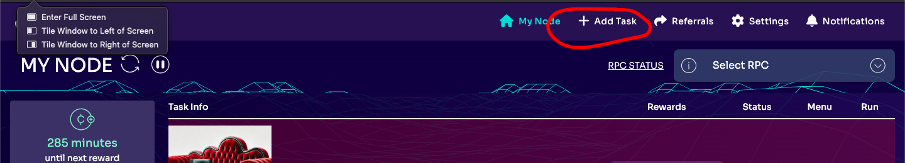

# Asshole in Chief Project
The "Asshole in Chief" project aims to identify a target on Twitter and troll them. The current target is @JDVance. Participants use a spare Twitter account to post a single comment per day with the format "(your text) + 🛋🛋🛋".

# Participation Requirements
1. Volunteer a spare Twitter account for trolling.
2. Ensure your volunteer Twitter account has passed the verification process.

Note: There are no rewards for this task currently, but we are planning events and bounties in the future.

# The Koii Network
The Koii Network empowers users by making their computers work for them when not used. Users (AKA nodes) are rewarded for running tasks they choose on their devices.

To use the code and modify it, the best approach is to go through the first EZsandbox exercise.

1. EZsandbox: To understand the Koii Network better, please go through the EZsandbox - it's beautifully written and gets you through the basics. EZsandbox https://github.com/koii-network/ezsandbox/blob/main/README.md
2. Koii Network Documentation: For further understanding, refer to the Koii Network documentatiom https://www.koii.network/docs

# How to Read Through the Code
The project has two main structures:
1. Twitter Logic: Includes adapters for negotiating session login and commenting.
2. Koii Logic: Managed by coreLogic.js, covering tasks, submissions, audits, and distributions.

Key Files and Modules
CoreLogic.js: Main file directing all operations in the project.
adapters/twitter: Adapter for interacting with the Twitter using puppeteer.

# How to Run the Project
These instructions are for running the task, not for experimenting with the code.

1. Go to Koii Network and download the Node.
2. Detailed instructions for how to sign up and use the Node are available here.
3. Click on "Add Task" 

4. Run the task!